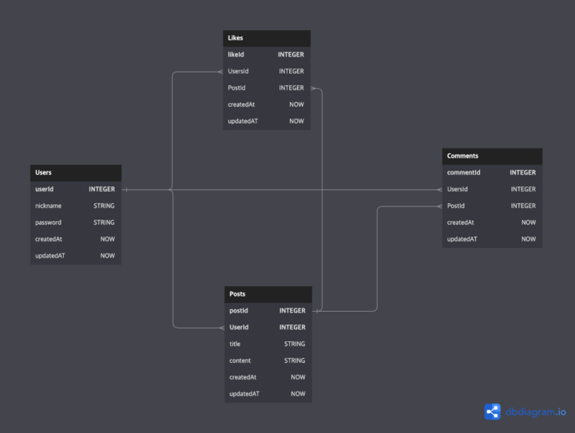

## ERD



## 폴더구조

```
Lv_4-node-project-solo
├─.gitignore
├─ app.js
├─ middlewares
│  └─ auth-middleware.js
├─ migrations
│  ├─ 20230706173814-create-users.js
│  ├─ 20230706174010-create-posts.js
│  ├─ 20230706174141-create-comments.js
│  └─ 20230706174211-create-likes.js
├─ models
│  ├─ comments.js
│  ├─ index.js
│  ├─ likes.js
│  ├─ posts.js
│  └─ users.js
├─ package-lock.json
├─ package.json
└─ seeders
```
